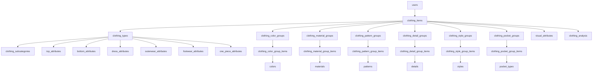
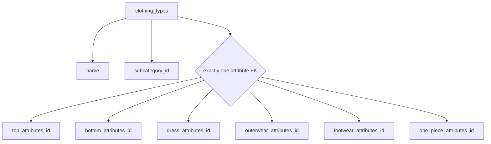
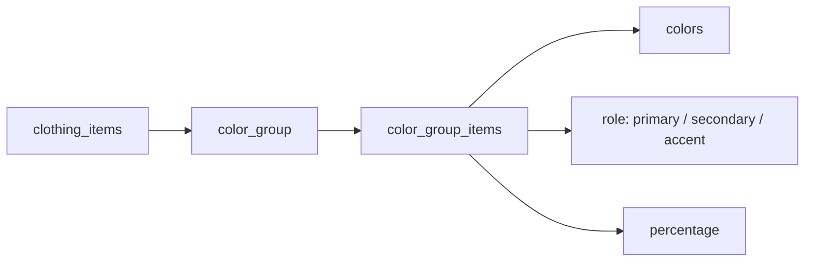
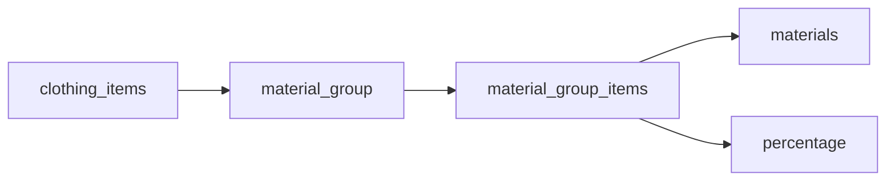
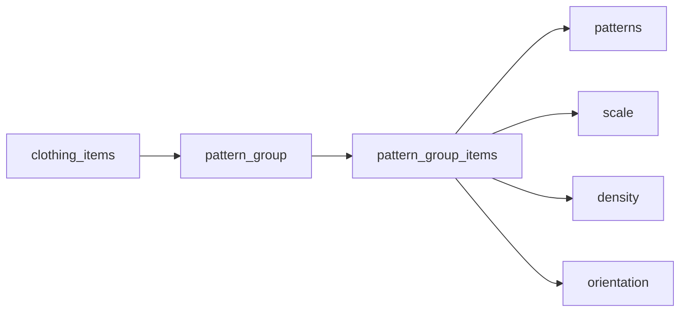

# WEARTHIS Clothing Database — Production Skeleton

> Scalable PostgreSQL/FastAPI/Kotlin data model for visually describing a single clothing item owned by a user.
> The main rule: keep `clothing_items` small, put type-specific attributes behind `type_id`, and isolate multi-value visual properties into groups.

## Architecture at a glance



## Core relationship

```mermaid
flowchart LR
    CI[ClothingItem] --> T[Type]
    T --> N[name]
    T --> SC[subcategory]
    T --> A[attributes]
    A --> X{depends on type}
    X --> TOP[top_attributes]
    X --> BOT[bottom_attributes]
    X --> DRESS[dress_attributes]
    X --> OUTER[outerwear_attributes]
    X --> FOOT[footwear_attributes]
    X --> ONE[one_piece_attributes]

    CI --> C[Colors[]]
    CI --> M[Materials[]]
    CI --> P[Patterns[]]
    CI --> D[Details[]]
    CI --> S[Styles[]]
    CI --> PK[Pockets[]]
    CI --> V[VisualAttributes]
    CI --> AN[Analysis]
```

## Implementation rules

| Rule | Decision |
|---|---|
| Main item table | Only fields common to every clothing item |
| Type-specific fields | Stored through `clothing_types` and exactly one type-attribute record |
| Multi-value properties | Use group + group-item + lookup-table pattern |
| Optional/inapplicable values | Use `none` where the attribute exists conceptually but does not apply |
| Empty collections | For details/pockets, use an empty group instead of a fake `none` row |
| AI output | Keep raw AI analysis separate from normalized wardrobe data |
| Future schema growth | Add new type attributes without changing `clothing_items` |

## Table map

| Area | Tables |
|---|---|
| Ownership | `users`, `clothing_items` |
| Type system | `clothing_types`, `clothing_subcategories` |
| Type attributes | `top_attributes`, `bottom_attributes`, `dress_attributes`, `outerwear_attributes`, `footwear_attributes`, `one_piece_attributes` |
| Colors | `clothing_color_groups`, `clothing_color_group_items`, `colors` |
| Materials | `clothing_material_groups`, `clothing_material_group_items`, `materials` |
| Patterns | `clothing_pattern_groups`, `clothing_pattern_group_items`, `patterns` |
| Details | `clothing_detail_groups`, `clothing_detail_group_items`, `details` |
| Styles | `clothing_style_groups`, `clothing_style_group_items`, `styles` |
| Pockets | `clothing_pocket_groups`, `clothing_pocket_group_items`, `pocket_types` |
| Visual metadata | `visual_attributes` |
| AI metadata | `clothing_analysis` |

---

# 1. users

```text
users
────────────────────────
id              UUID PK
...
```

Your normal user table.

---

# 2. clothing\_items

Only properties every clothing item has.

```text
clothing_items
────────────────────────────────
id                      UUID PK
user_id                 UUID FK -> users.id

image_url               TEXT

type_id                 UUID FK -> clothing_types.id

color_group_id          UUID FK -> clothing_color_groups.id
material_group_id       UUID FK -> clothing_material_groups.id
pattern_group_id        UUID FK -> clothing_pattern_groups.id
detail_group_id         UUID FK -> clothing_detail_groups.id
style_group_id          UUID FK -> clothing_style_groups.id
pocket_group_id         UUID FK -> clothing_pocket_groups.id

visual_attributes_id    UUID FK -> visual_attributes.id

analysis_id             UUID FK -> clothing_analysis.id NULL

created_at              TIMESTAMP
updated_at              TIMESTAMP
```

Example:

```text
id: cloth_123
user_id: user_10
image_url: /wardrobe/black_hoodie.jpg

type_id: type_501

color_group_id: colors_501
material_group_id: materials_501
pattern_group_id: patterns_501
detail_group_id: details_501
style_group_id: styles_501
pocket_group_id: pockets_501

visual_attributes_id: visual_501
analysis_id: analysis_501
```

---

# 3. clothing\_types




This is the important part.

`clothing_items` only contains:

```text
type_id
```

The actual type object contains the type name + its specific attributes.

```text
clothing_types
────────────────────────────────
id                          UUID PK

name                        clothing_type

subcategory_id              FK -> clothing_subcategories.id

top_attributes_id           UUID FK NULL
bottom_attributes_id        UUID FK NULL
dress_attributes_id         UUID FK NULL
outerwear_attributes_id     UUID FK NULL
footwear_attributes_id      UUID FK NULL
one_piece_attributes_id     UUID FK NULL
```

Allowed `name`:

```text
top
bottom
dress
outerwear
footwear
one_piece
```

Only **one attribute ID should be populated**.

Example:

```text
id: type_501
name: top
subcategory_id: hoodie

top_attributes_id: top_attr_501

bottom_attributes_id: NULL
dress_attributes_id: NULL
outerwear_attributes_id: NULL
footwear_attributes_id: NULL
one_piece_attributes_id: NULL
```

So your API/Kotlin model can expose:

```text
type:
{
    name: "top",
    subcategory: "hoodie",
    attributes: {
        ...
    }
}
```

---

# 4. clothing\_subcategories

```text
clothing_subcategories
────────────────────────────
id
type_name
name
```

Allowed examples:

### top

```text
t_shirt
shirt
button_up
polo
tank_top
crop_top
blouse
sweater
sweatshirt
hoodie
cardigan
jersey
vest
turtleneck
other
```

### bottom

```text
jeans
trousers
chinos
shorts
sweatpants
joggers
leggings
skirt
cargo_pants
dress_pants
track_pants
other
```

### dress

```text
mini_dress
midi_dress
maxi_dress
shirt_dress
bodycon_dress
wrap_dress
slip_dress
sundress
cocktail_dress
formal_dress
other
```

### outerwear

```text
jacket
coat
blazer
denim_jacket
leather_jacket
bomber_jacket
puffer_jacket
windbreaker
rain_jacket
trench_coat
parka
overcoat
other
```

### footwear

```text
sneakers
running_shoes
boots
ankle_boots
dress_shoes
loafers
oxfords
sandals
slides
heels
flats
slippers
other
```

### one\_piece

```text
jumpsuit
romper
overalls
bodysuit
tracksuit
other
```

---

# 5. top\_attributes

```text
top_attributes
────────────────────────────
id

sleeve_length
sleeve_type
neckline
collar_type
shoulder_style
hem_style
closure_type
hood_type
fit
length
```

### sleeve\_length

```text
none
sleeveless
cap
short
elbow
three_quarter
long
extra_long
```

### sleeve\_type

```text
none
regular
raglan
set_in
drop_shoulder
puff
bell
bishop
batwing
flutter
rolled
```

### neckline

```text
none
crew
round
v_neck
deep_v
square
scoop
boat
halter
sweetheart
turtleneck
mock_neck
off_shoulder
one_shoulder
henley
```

### collar\_type

```text
none
shirt
spread
point
button_down
mandarin
polo
camp
peter_pan
shawl
notched
stand
```

### shoulder\_style

```text
none
regular
drop_shoulder
raglan
structured
padded
off_shoulder
one_shoulder
```

### hem\_style

```text
none
straight
curved
rounded
asymmetric
cropped
ribbed
raw
split
```

### closure\_type

```text
none
pullover
buttons
zipper
half_zip
quarter_zip
snap
hook_and_eye
tie
```

### hood\_type

```text
none
fixed
detachable
oversized
drawstring
```

### fit

```text
skinny
slim
fitted
regular
relaxed
oversized
boxy
```

### length

```text
cropped
waist
hip
longline
oversized_long
```

---

# 6. bottom\_attributes

```text
bottom_attributes
────────────────────────────
id

rise
leg_shape
waistband_type
hem_style
closure_type
fit
length
```

### rise

```text
none
low
mid
high
ultra_high
```

### leg\_shape

```text
none
skinny
slim
straight
tapered
wide
flare
bootcut
baggy
carrot
```

### waistband\_type

```text
none
standard
elastic
drawstring
belted
ribbed
foldover
```

### closure\_type

```text
none
zip_fly
button_fly
buttons
drawstring
elastic
hook_and_bar
side_zip
```

### fit

```text
skinny
slim
regular
relaxed
loose
baggy
oversized
```

### length

```text
micro
short
knee
below_knee
cropped
ankle
full
floor
```

---

# 7. dress\_attributes

```text
dress_attributes
────────────────────────────
id

sleeve_length
sleeve_type
neckline
strap_type
silhouette
dress_length
back_style
closure_type
fit
```

### strap\_type

```text
none
strapless
spaghetti
thin
medium
wide
halter
one_shoulder
```

### silhouette

```text
straight
a_line
bodycon
fit_and_flare
empire
shift
sheath
wrap
slip
ball_gown
mermaid
```

### dress\_length

```text
mini
above_knee
knee
midi
maxi
floor
```

### back\_style

```text
closed
open_back
low_back
cross_back
racerback
keyhole
lace_up
```

Other shared values like `neckline`, `sleeve_length`, and `closure_type` use the same vocabularies as tops.

---

# 8. outerwear\_attributes

```text
outerwear_attributes
────────────────────────────
id

sleeve_length
collar_type
lapel_type
closure_type
hood_type
jacket_length
fit
insulation
```

### lapel\_type

```text
none
notch
peak
shawl
```

### jacket\_length

```text
cropped
waist
hip
mid_thigh
knee
below_knee
full_length
```

### insulation

```text
none
light
medium
heavy
padded
down
fleece_lined
```

---

# 9. footwear\_attributes

```text
footwear_attributes
────────────────────────────
id

shoe_height
toe_shape
heel_type
heel_height
shoe_closure
sole_type
shoe_profile
```

### shoe\_height

```text
low
ankle
mid
high
knee
over_knee
```

### toe\_shape

```text
round
almond
square
pointed
open
wide
```

### heel\_type

```text
none
flat
block
stiletto
kitten
wedge
platform
cone
```

### heel\_height

```text
none
flat
low
medium
high
very_high
```

### shoe\_closure

```text
none
slip_on
laces
zipper
buckle
velcro
strap
elastic
```

### sole\_type

```text
flat
rubber
foam
leather
lug
platform
chunky
crepe
```

### shoe\_profile

```text
minimal
standard
chunky
sleek
athletic
rugged
```

---

# 10. one\_piece\_attributes

```text
one_piece_attributes
────────────────────────────
id

sleeve_length
sleeve_type
neckline
collar_type

leg_shape
length

waist_style
closure_type
fit
```

### waist\_style

```text
none
natural
high
low
elastic
drawstring
belted
fitted
```

---

# 11. Colors




Because an item can have several colors:

```text
clothing_color_groups
─────────────────────
id
```

```text
clothing_color_group_items
──────────────────────────
id
group_id        FK -> clothing_color_groups.id
color_id        FK -> colors.id

role
percentage NULL
```

```text
colors
─────────────────────
id
name
hex_value NULL
```

Allowed names:

```text
black
white
gray
charcoal
silver

cream
ivory
beige
tan
khaki
camel
brown

red
burgundy
maroon
pink
rose

orange
coral
peach

yellow
gold
mustard

green
lime
olive
sage
mint
emerald
forest_green

blue
navy
royal_blue
sky_blue
baby_blue
teal
turquoise

purple
lavender
violet
plum

multicolor
transparent
unknown
```

`role`:

```text
primary
secondary
accent
```

Example:

```text
color_group_20
    black   primary     70
    white   secondary   20
    red     accent      10
```

---

# 12. Materials




```text
clothing_material_groups
────────────────────────
id
```

```text
clothing_material_group_items
─────────────────────────────
id
group_id
material_id
percentage NULL
```

```text
materials
────────────────────
id
name
```

Allowed values:

```text
cotton
organic_cotton

denim
linen

wool
merino_wool
cashmere

silk
satin

velvet
corduroy

leather
faux_leather
suede
faux_suede

polyester
nylon
acrylic
spandex
elastane

rayon
viscose
modal

fleece
jersey
canvas
mesh
lace
chiffon
tweed

rubber

synthetic
mixed
unknown
```

---

# 13. Patterns




```text
clothing_pattern_groups
───────────────────────
id
```

```text
clothing_pattern_group_items
────────────────────────────
id
group_id
pattern_id

scale
density
orientation
```

```text
patterns
────────────────
id
name
```

Allowed pattern:

```text
none
solid

striped
checked
plaid
gingham

polka_dot

floral
animal_print
camouflage

geometric
abstract
paisley

tie_dye
gradient
ombre
color_block

graphic
logo
text

other
```

### scale

```text
none
small
medium
large
mixed
```

### density

```text
none
sparse
medium
dense
```

### orientation

```text
none
horizontal
vertical
diagonal
mixed
```

---

# 14. Details

```text
clothing_detail_groups
──────────────────────
id
```

```text
clothing_detail_group_items
───────────────────────────
id
group_id
detail_id
```

```text
details
──────────────────
id
name
```

Allowed:

```text
embroidery
sequins
beading
rhinestones
studs

fringe
tassels
ruffles
bows

lace
patches
applique

distressing
rips
cutouts

pleats
gathers
smocking
quilting

contrast_stitching
piping

chains
buckles

visible_buttons
visible_zippers

logo
graphic
text
```

Don't store `none` as a row here.

If there are no details:

```text
detail_group = empty
```

---

# 15. Style tags

```text
clothing_style_groups
─────────────────────
id
```

```text
clothing_style_group_items
──────────────────────────
id
group_id
style_id
confidence NULL
```

```text
styles
────────────────
id
name
```

Allowed:

```text
minimalist
classic
casual

smart_casual
business_casual
formal

preppy
old_money
quiet_luxury

streetwear
urban
skater

sporty
athleisure

workwear
utility
military

outdoorsy
gorpcore
techwear

vintage
retro
y2k

bohemian
romantic

western

grunge
punk
gothic

edgy

avant_garde
```

Example:

```text
streetwear    0.92
minimalist    0.71
sporty        0.46
```

---

# 16. Pockets

```text
clothing_pocket_groups
──────────────────────
id
```

```text
clothing_pocket_group_items
───────────────────────────
id
group_id
pocket_type_id
count
```

```text
pocket_types
────────────────
id
name
```

Allowed:

```text
side
slash
patch
chest
cargo
welt
zippered
kangaroo
back
coin
hidden
flap
```

If there are no pockets:

```text
pocket_group = empty
```

---

# 17. Visual attributes

These describe the overall visual appearance.

```text
visual_attributes
────────────────────────────────
id

dominant_color_hex

brightness
saturation

visual_complexity
statement_level

structure
surface_finish
transparency
symmetry
```

### brightness

```text
very_dark
dark
medium
light
very_light
```

### saturation

```text
desaturated
muted
medium
vibrant
highly_vibrant
```

### visual\_complexity

```text
very_simple
simple
moderate
busy
very_busy
```

### statement\_level

```text
basic
subtle
moderate
statement
bold
```

### structure

```text
soft
semi_structured
structured
rigid
```

### surface\_finish

```text
matte
semi_matte
semi_gloss
glossy
metallic
sparkly
```

### transparency

```text
opaque
slightly_sheer
sheer
transparent
```

### symmetry

```text
symmetric
mostly_symmetric
asymmetric
```

---

# 18. AI analysis

Keep AI-generated data separate from the actual normalized wardrobe data.

```text
clothing_analysis
────────────────────────────────
id

model_name
model_version

raw_response        JSONB

overall_confidence  FLOAT

created_at
```

Example:

```text
model_name:
gemini-2.5-flash

raw_response:
{
    "type": "top",
    "subcategory": "hoodie",
    "colors": [
        {
            "name": "black",
            "role": "primary"
        }
    ],
    "style": [
        "streetwear",
        "casual"
    ]
}

overall_confidence:
0.93
```

---

# Final relationship

The important part of your design is:

```text
ClothingItem
│
├── Type
│    │
│    ├── name
│    ├── subcategory
│    │
│    └── attributes
│         └── depends on name
│
├── Colors[]
├── Materials[]
├── Patterns[]
├── Details[]
├── Styles[]
├── Pockets[]
│
├── VisualAttributes
│
└── Analysis
```

Example final object:

```text
ClothingItem
│
├── id: cloth_123
├── user_id: user_1
├── image_url: black_hoodie.jpg
│
├── type
│    ├── name: top
│    ├── subcategory: hoodie
│    │
│    └── attributes
│         ├── sleeve_length: long
│         ├── sleeve_type: regular
│         ├── neckline: none
│         ├── collar_type: none
│         ├── shoulder_style: drop_shoulder
│         ├── hem_style: ribbed
│         ├── closure_type: pullover
│         ├── hood_type: drawstring
│         ├── fit: oversized
│         └── length: hip
│
├── colors
│    └── black / primary / 100%
│
├── materials
│    ├── cotton / 70%
│    └── polyester / 30%
│
├── patterns
│    └── solid
│
├── details
│    └── none
│
├── styles
│    ├── streetwear
│    └── casual
│
├── pockets
│    └── kangaroo / 1
│
└── visual_attributes
     ├── brightness: dark
     ├── saturation: muted
     ├── visual_complexity: simple
     ├── statement_level: basic
     ├── structure: soft
     ├── surface_finish: matte
     ├── transparency: opaque
     └── symmetry: symmetric
```

This is the version I'd use as the **first production skeleton** for PostgreSQL + FastAPI + Kotlin. The big advantage is that adding something like `cuff_type`, `shoe_material`, `graphic_position`, or a completely new clothing type later does **not require changing the main** **`clothing_items`** **model**.